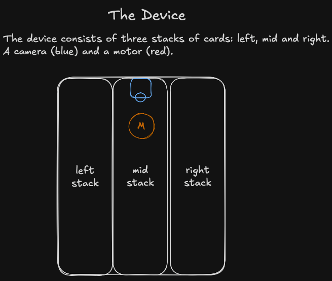
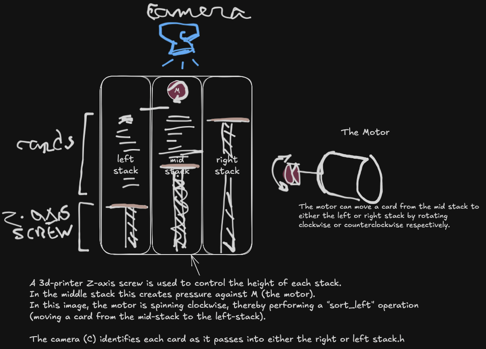
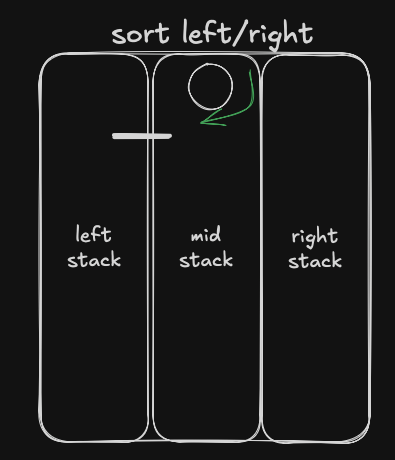
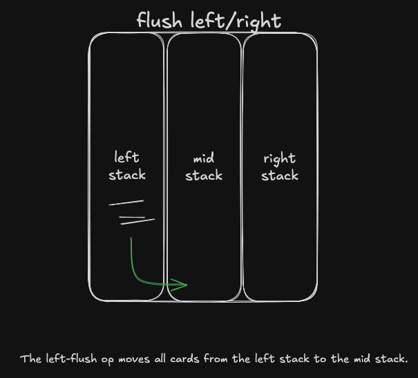
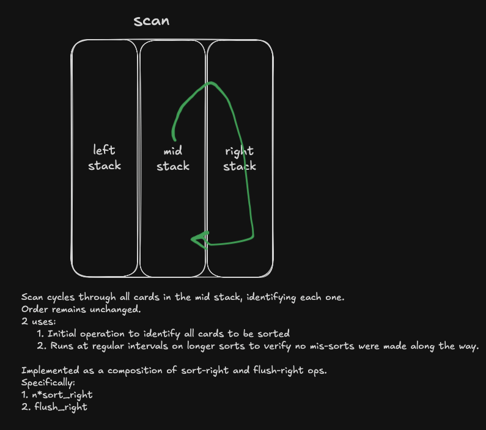
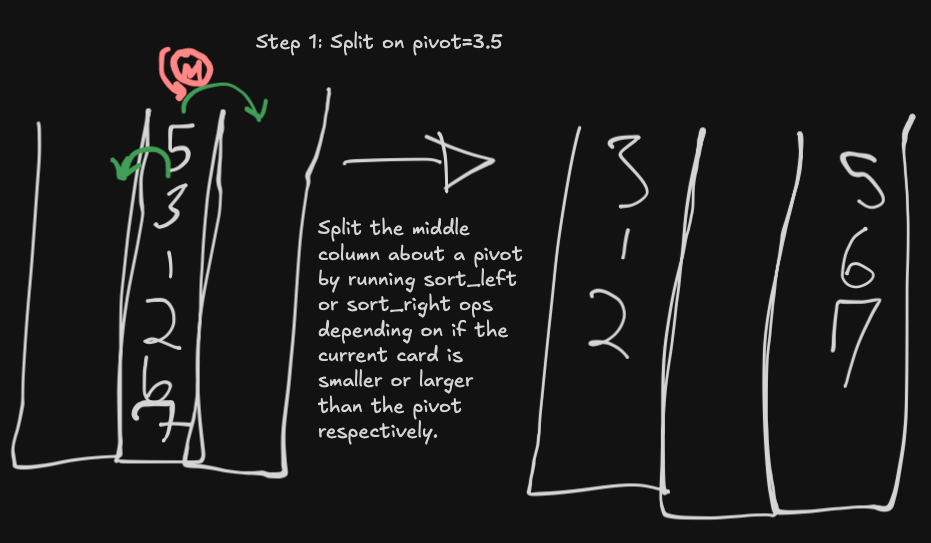
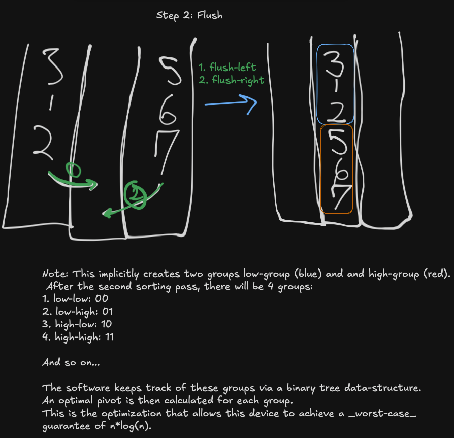

# MTG Card Sorter
The following repo contains software and schematics for an 3d-printable MTG card sorter.
The idea is to achieve a _guaranteed_ n*log(n) mechanical sort time on about a 1000 cards in about 2 hours at 1 second a card.
Though it's possible that it could operate faster than 1 sort/sec (see *note-on-speed below).

The device need only implement 2 mechanical operations:
1. sort - moves a card from the middle stack to the left or right stack
2. flush - move all cards from the left or right stack back into the middle stack.

The following schematics illustrate these operations and describe the algorithm.

# Device Schematics

This shows an early attempt to think about how the mechanics of this device could operate.
The following device could theoretically accomplish sort and scan operations, but not flush.
Mechanical ideas are very welcome.

# Operations
Again, the elegance of this device is that it need only implement 2 mechanical operations: sort and flush.

## Sort
Sort moves a single card from the middle stack to the left (sort-left) or right stack (sort-right) by spinning the motor clockwise or counterclockwise respectively.

## Flush
Flush moves an entire outer stack to the middle stack in-order.

Ideally this would be in-order (eg. left wall pushes in for instance).
Though it's possible it could work in reverse order (think motors at the bottom of the left and right stacks).
Current solution assumes an in-order flush.
Current schematic doesn't have a mechanical solution to achieve this flush operation.

## ID
The id op identifies a card using via the camera. Used in the scan op below.

*note-on-speed: Identification need not happen on each sort-left/right op.
So long as the error-rate on sort-left/right is low enough, we could gain a lot of speed by choosing to scan at regular intervals
and skipping ids on non-scan, sorting iterations. This could allow sub-second singular sorting ops.

## Scan
Scan is a software op because it can be implemented via sorts and flushes.
It exponentially accelerates sort times as well as limits the effects of mechanistic errors.

# Example: 1st iteration of sort
Once we load our cards to be sorted into the middle stack the first thing the sorter will do is scan the stack to identify which cards are to be sorted.
Then an in-memory sort (less than a second) is performed on each card's rank index (defined by the user's sorting criteria).
In addition to identification, this in memory sort will allow the software to choose optimal pivots at every sorting iteration to follow.

Now we'll look at the first iteration of a sort.
Each sort iteration involves 3 steps:
1. splitting mid on a pivot
2. flush left
3. flush right

## Split
Uses sort-left and sort-right.

## Flush

# Help Needed!
 Congrats on making it this far!
 I could use some help with a few things:
1. servo control - arduino or rasperry pi equivalent to control the motor, camera and flushing mechanisms
2. 3d-modeling - want all non-electronic components to be 3d-printable on commodity FDM printers

# TODO
- Create module that uses cvxpy to identify cards.
  I can take care of this one as I've done this before.
  Will tackle this when we decide on a camera and control module,
  as there is a lot of fine-tuning involved with cvxpy to achieve high accuracy.
